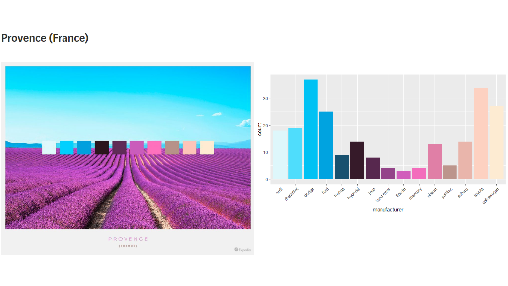
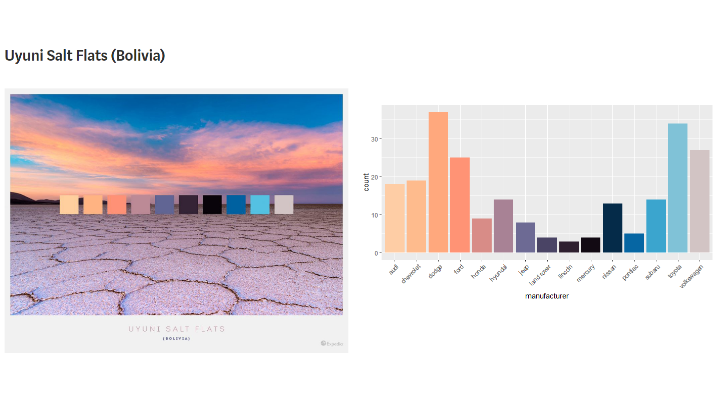
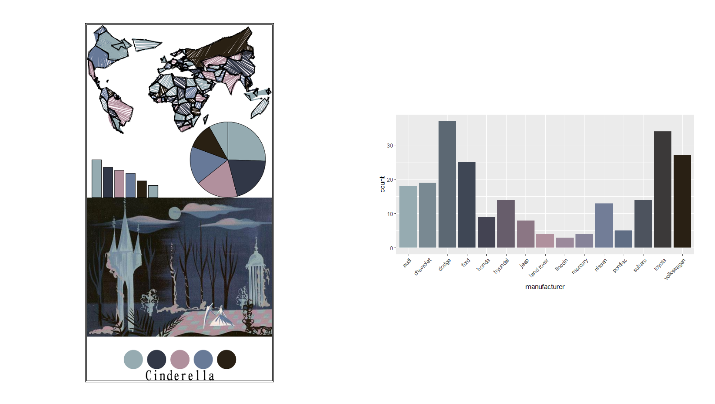
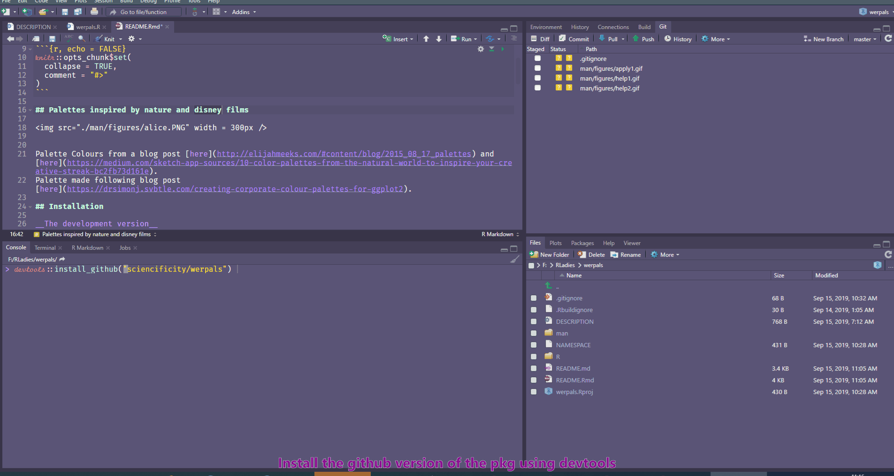

<!-- README.md is generated from README.Rmd. Please edit that file -->

```{r, include = FALSE}
knitr::opts_chunk$set(
  collapse = TRUE,
  comment = "#>",
  fig.path = "man/figures/README-",
  out.width = "100%"
)
```

# werpals
Pronounced __`We Are Pals`__ [pals for palettes ;)]

## Palettes inspired by nature and disney films

 


Palette Colours inspired from a blog post [here](http://elijahmeeks.com/#content/blog/2015_08_17_palettes) and [here](https://medium.com/sketch-app-sources/10-color-palettes-from-the-natural-world-to-inspire-your-creative-streak-bc2fb73d161e).
Palette made following this blog post [here](https://drsimonj.svbtle.com/creating-corporate-colour-palettes-for-ggplot2).


<!-- badges: start -->
<!-- badges: end -->

The goal of werpals is to provide a few additional palettes to use with your ggplot plots.

## Installation - __The development version__

You can install the development version from [GitHub](https://github.com/) with:

```{r, eval = FALSE}
devtools::install_github("sciencificity/werpals")
```

## Usage

There are a few functions that may be used with ggplot2 plots:

__Disney Like Colours -__

* scale_colour_disney() OR scale_color_disney() for one of the disney-like palettes to be applied.
* scale_fill_disney() to fill with disney-like palette. 

__Nature Like Colours -__

* scale_colour_nature() OR scale_color_nature() for one of the nature like palettes to be applied.
* scale_fill_nature() to fill with nature like palette. 

__See the palettes -__

Call `werpals_display(pal = "nature")` or `werpals_display(pal = "disney")` to view the palettes available in each. Thanks to Jonathan Kitt for this lovely addition!
 
### Example Code
You may run the examples in the code below to see the difference in applying these colour scales. In addition use the help functions and navigate to the bottom of the help page where you will find some examples.

* ?scale_colour_disney
* ?scale_fill_disney
* ?scale_colour_nature
* ?scale_fill_nature 

```{r example, message = FALSE, warning = FALSE, eval = FALSE}
library(werpals)
library(tidyverse)

# See all palettes of disney
names(disney_palettes)

# See all palettes of nature
names(nature_palettes)

# See number discrete values in "main" the combo palette
str_glue("The number of discrete colours in the `main` disney palette is: {length(disney_palettes[['main']])}")

# See number discrete values in "main" the combo palette
str_glue("The number of discrete colours in the `main` nature palette is: {length(nature_palettes[['main']])}")

# Examples taken from ?scale_colour_discrete and amended
dsamp <- diamonds[sample(nrow(diamonds), 1000), ]
(d <- ggplot(dsamp, aes(carat, price)) + geom_point(aes(colour = clarity)))
# Change scale to disney default
d + scale_colour_disney()
# Change scale to disney - `alice` palette
d + scale_colour_disney("alice")

# Lookup colours of one palette
disney_palettes[["cinderella"]]

# Another example taken from ?scale_colour_discrete and amended
miss <- factor(sample(c(NA, 1:5), nrow(mtcars), replace = TRUE))
ggplot(mtcars, aes(mpg, wt)) +
  geom_point(aes(colour = miss)) +
  scale_colour_disney(palette = "when_i_was_your_age", na.value = "black")

# Fill by discrete variable with different palette + remove legend (guide)
ggplot(mpg, aes(manufacturer, fill = manufacturer)) +
    geom_bar() +
    theme(axis.text.x = element_text(angle = 45, hjust = 1)) +
    scale_fill_nature(palette = "jozi", guide = "none")
```

```{r, message = FALSE, warning = FALSE, eval = FALSE}
# Recreate the plots displayed in the images below
ggplot(mpg, aes(manufacturer, fill = manufacturer)) +
  geom_bar() +
  theme(axis.text.x = element_text(angle = 45, hjust = 1)) +
  scale_fill_nature(palette = "provence", guide = "none")

ggplot(mpg, aes(manufacturer, fill = manufacturer)) +
  geom_bar() +
  theme(axis.text.x = element_text(angle = 45, hjust = 1)) +
  scale_fill_disney(palette = "cinderella", guide = "none")
```
```{r, echo = FALSE, eval = FALSE}
library(cowplot)
library(magick)
p1 <- ggdraw() + draw_image("man/figures/provence_blog.PNG", scale = 1)
p2 <- ggdraw() + draw_image("man/figures/ggplot_provence.png")

plot_grid(p1, p2)

p1 <- ggdraw() + draw_image("man/figures/cinderella_blog.PNG")
p2 <- ggdraw() + draw_image("man/figures/ggplot_cinderella.png")

plot_grid(p1, p2)
```

### The Disney Colours

```{r, eval = TRUE}
werpals::werpals_display("disney")
```

### The Nature Colours
```{r}
werpals::werpals_display("nature")
```

 

 

 

### Getting help

 

### Using the scale_fill_disney

 
