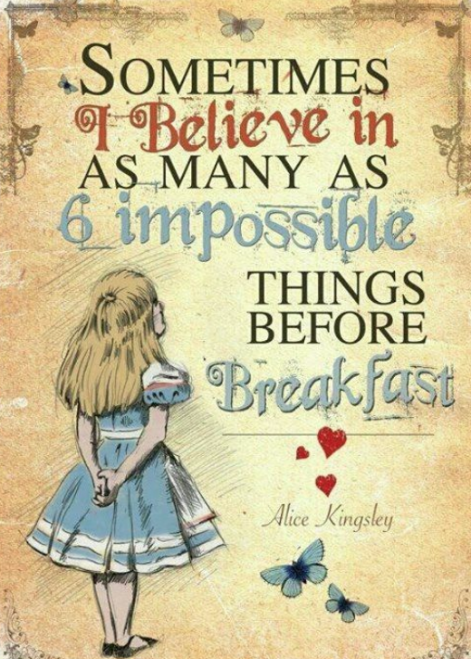

## Palettes inspired by nature and disney films



Palette Colours from a blog post
[here](http://elijahmeeks.com/#content/blog/2015_08_17_palettes) and
[here](https://medium.com/sketch-app-sources/10-color-palettes-from-the-natural-world-to-inspire-your-creative-streak-bc2fb73d161e).
Palette made following blog post
[here](https://drsimonj.svbtle.com/creating-corporate-colour-palettes-for-ggplot2).

## Installation

**The development version**

``` r
devtools::install_github("sciencificity/werpals")
```

## Usage

``` r
library(werpals)
library(tidyverse)
library(cowplot)
library(magick)

# See all palettes of disney
names(disney_palettes)
#> [1] "main"                "cinderella"          "monet"              
#> [4] "small_world"         "alice"               "pan"                
#> [7] "when_i_was_your_age" "firefly"

# See all palettes of nature
names(nature_palettes)
#>  [1] "main"        "uyuni"       "okavango"    "lakelouise"  "provence"   
#>  [6] "halong"      "vatnajokull" "arashiyama"  "mountcook"   "benagil"    
#> [11] "bryce"       "jozi"

# See number discrete values in "main" the combo palette
str_glue("The number of discrete colours in the `main` disney palette is: {length(disney_palettes[['main']])}")
#> The number of discrete colours in the `main` disney palette is: 45

# See number discrete values in "main" the combo palette
str_glue("The number of discrete colours in the `main` nature palette is: {length(nature_palettes[['main']])}")
#> The number of discrete colours in the `main` nature palette is: 110

# Examples taken from ?scale_colour_discrete and amended
dsamp <- diamonds[sample(nrow(diamonds), 1000), ]
(d <- ggplot(dsamp, aes(carat, price)) + geom_point(aes(colour = clarity)))
```

<!-- -->

``` r
# Change scale to disney default
d + scale_colour_disney()
```

<!-- -->

``` r
# Change scale to disney - `alice` palette
d + scale_colour_disney("alice")
```

<!-- -->

``` r

# Lookup colours of one palette
disney_palettes[["cinderella"]]
#>     cind1     cind2     cind3     cind4     cind5 
#> "#96abb1" "#313746" "#b0909d" "#687a97" "#292014"

# Another example taken from ?scale_colour_discrete and amended
miss <- factor(sample(c(NA, 1:5), nrow(mtcars), replace = TRUE))
ggplot(mtcars, aes(mpg, wt)) +
  geom_point(aes(colour = miss)) +
  scale_colour_disney(palette = "when_i_was_your_age", na.value = "black")
```

<!-- -->

``` r

# Fill by discrete variable with different palette + remove legend (guide)
ggplot(mpg, aes(manufacturer, fill = manufacturer)) +
    geom_bar() +
    theme(axis.text.x = element_text(angle = 45, hjust = 1)) +
    scale_fill_nature(palette = "jozi", guide = "none")
```

<!-- -->

``` r
# Recreate the plots displayed in the images below
ggplot(mpg, aes(manufacturer, fill = manufacturer)) +
  geom_bar() +
  theme(axis.text.x = element_text(angle = 45, hjust = 1)) +
  scale_fill_nature(palette = "provence", guide = "none")
```

<!-- -->

``` r

ggplot(mpg, aes(manufacturer, fill = manufacturer)) +
  geom_bar() +
  theme(axis.text.x = element_text(angle = 45, hjust = 1)) +
  scale_fill_disney(palette = "cinderella", guide = "none")
```

<!-- -->

``` r


p1 <- ggdraw() + draw_image("man/figures/provence_blog.PNG", scale = 0.9)
p2 <- ggdraw() + draw_image("man/figures/ggplot_provence.png", scale = 0.9)

plot_grid(p1, p2)
```

<!-- -->

``` r

p1 <- ggdraw() + draw_image("man/figures/cinderella_blog.PNG", scale = 0.9)
p2 <- ggdraw() + draw_image("man/figures/ggplot_cinderella.png", scale = 0.9)

plot_grid(p1, p2)
```

<!-- -->
